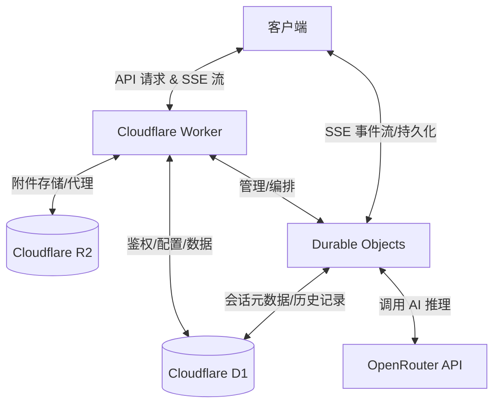

[English](README.md) | 简体中文

# 🌸 Arona Chat


[](https://arona-chat-open.pages.dev/login?password=preview&autologin=1)

Arona Chat 是一个高性能 AI 聊天界面，灵感来自 _Blue Archive_ 中的 “Shittim Chest” UI。项目依托 Cloudflare 无服务器生态（Workers、D1、R2、Durable Objects），提供低成本且具备状态保持能力的聊天体验。

## 🧠 系统架构



## 🧠 亮点特性

- 💰 **实时成本追踪**（tokens + USD 用量统计）
- 🧠 **多模型编排**（基于 OpenRouter）
- 📡 **有状态 SSE 流式输出**（Durable Objects 支持）
- 🧷 **高可靠连接层**（断线自动恢复）

## 🖼️ 截图展示


## 🚀 快速开始

```bash
npm install
```

```bash
cp backend/.dev.vars.example backend/.dev.vars
```

```bash
npm run dev
```

## 🌟 项目来源

本项目作为 Hack Club Stardance 的一部分开发。

项目页面：[https://stardance.hackclub.com/projects/17862](https://stardance.hackclub.com/projects/17862)

## 📁 仓库状态

这是 Arona Chat 项目的 **公开镜像仓库**。
实际开发发生在私有上游仓库中，本镜像会定期同步稳定版本。

## 🤝 贡献方式

欢迎通过 Issue 提交 bug 报告与反馈。
Pull Request 并不是本仓库的主要开发方式。

## 许可证

采用 **GNU Affero General Public License v3** 许可协议。
详见 [LICENSE](LICENSE)。

## 资源说明

详见 [docs/RESOURCE_COPYRIGHT.md](docs/RESOURCE_COPYRIGHT.md)

本项目为粉丝向作品，与 Blue Archive、NEXON、Nexon Games 或 Yostar 无任何官方关联。
