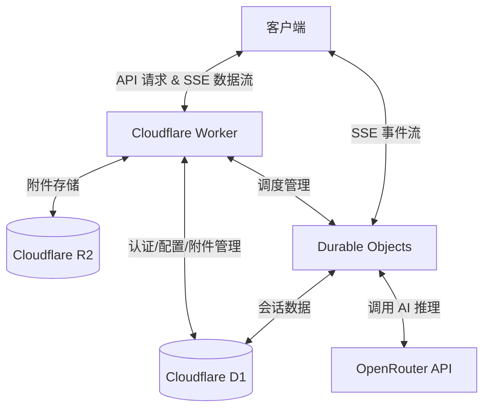

[English](README.md) | 简体中文

# Arona Chat


Arona Chat 是一款灵感源自《蔚蓝档案》（Blue Archive）“什亭之匣”（Shittim Chest）UI 的高性能 AI 聊天界面。项目采用 Monorepo 架构，利用 Cloudflare 无服务器生态系统（Workers, D1, R2, Durable Objects），实现了高性价比且具备状态持久化的聊天体验。

---

## 架构概览

Arona Chat 使用 **Durable Objects** 将客户端连接与推理过程解耦，确保 SSE（Server-Sent Events）连接具备高弹性。即使遇到网络抖动或断连，依然能保证对话流的可靠性，并最终将对话历史原子化地持久化至 Cloudflare D1。



## 截图


## 技术亮点

- **多模型智能与成本分析**：深度集成 OpenRouter，支持多种前沿 LLM，并提供原生的实时 Token 用量和美元成本追踪。
- **状态化且高弹性的 SSE Orchestration**：通过 Durable Objects 解耦连接，确保对话处理不被网络抖动中断，并保证历史记录的可靠存储。

## 主要功能

- 基于路由的会话管理
- 支持密码和 Passkey 认证
- 工作区、附件及库管理
- 模型选择与聊天设置

## 环境先决条件

在本地运行项目前，请确保已安装以下工具：

- **Node.js**: v20+ (推荐使用 LTS 版本)
- **Wrangler CLI**: `npm install -g wrangler` (Cloudflare 开发工具)
- **Cloudflare 账户**: 用于部署 D1, R2 及 Durable Objects

## 快速开始

1. **安装依赖:**

   ```bash
   npm install
   ```

2. **准备后端环境变量:**

   ```bash
   cp backend/.dev.vars.example backend/.dev.vars
   # 请根据你的 API Key 及配置编辑 backend/.dev.vars
   ```

3. **启动开发环境:**
   ```bash
   npm run dev
   ```

_更多可用脚本请参考 `package.json`。_

---

## 仓库状态

这是 Arona Chat 项目的**公共镜像仓库**。开发工作在私有的上游仓库中进行，此镜像会定期同步稳定版本。

## 贡献指南

欢迎提交 Issues 反馈 Bug 或建议。本项目主要工作流不在当前仓库，因此不建议直接发起 Pull Requests。

## 资源与商标声明

有关《蔚蓝档案》的资源声明，请参阅 [docs/RESOURCE_COPYRIGHT.md](docs/RESOURCE_COPYRIGHT.md)。

本项目为爱好者作品，与《蔚蓝档案》、NEXON、Nexon Games 或 Yostar 无关联。“Blue Archive” 和 “Arona” 是其各自所有者的商标和/或版权。

## 许可协议

本项目采用 **GNU Affero General Public License v3** 许可协议。详情请参阅 [LICENSE](LICENSE)。
