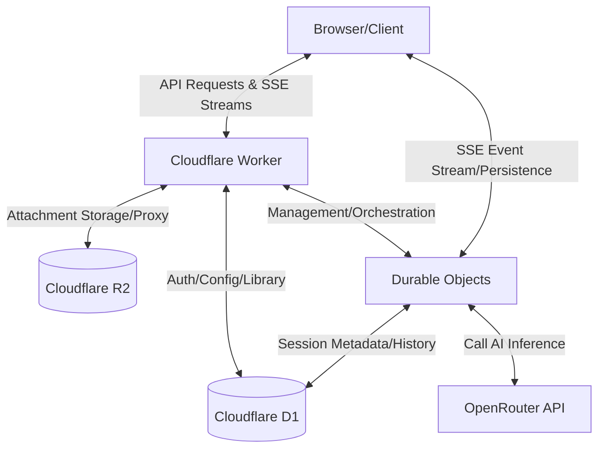

English | [简体中文](README-cn.md)

# 🌸 Arona Chat


[](https://arona-chat-open.pages.dev/login?password=preview&autologin=1)

Arona Chat is a high-performance AI chat interface inspired by the _Blue Archive_ "Shittim Chest" UI. Built as a monorepo, it leverages the Cloudflare serverless ecosystem (Workers, D1, R2, Durable Objects) to deliver a cost-efficient, stateful chat experience.

## 🧠 System Architecture



## 🧠 Highlights

- 💰 **Real-time cost tracking** (tokens + USD usage)
- 🧠 **Multi-model orchestration** via OpenRouter
- 📡 **Stateful SSE streaming** with Durable Objects
- 🧷 **Resilient connection layer** (auto recovery on disconnect)

## 🖼️ Screenshots


## 🚀 Quick Start

```bash
npm install
```

```bash
cp backend/.dev.vars.example backend/.dev.vars
```

```bash
npm run dev
```

## 🌟 Project Origin

This project was developed as part of Hack Club Stardance.

View the original project page: [https://stardance.hackclub.com/projects/17862](https://stardance.hackclub.com/projects/17862)

## 📁 Repository Status

This is a **public mirror** of the Arona Chat project.
Development occurs in a private upstream repository; this mirror is updated periodically with stable versions.

## 🤝 Contributions

Issues are welcome for bug reports and feedback.
Pull requests are not the primary workflow for this repository.

## License

Licensed under **GNU Affero General Public License v3**.
See [LICENSE](LICENSE).

## Resource Notice

See [docs/RESOURCE_COPYRIGHT.md](docs/RESOURCE_COPYRIGHT.md)

This is a fan-made project and is not affiliated with Blue Archive, NEXON, Nexon Games, or Yostar.
