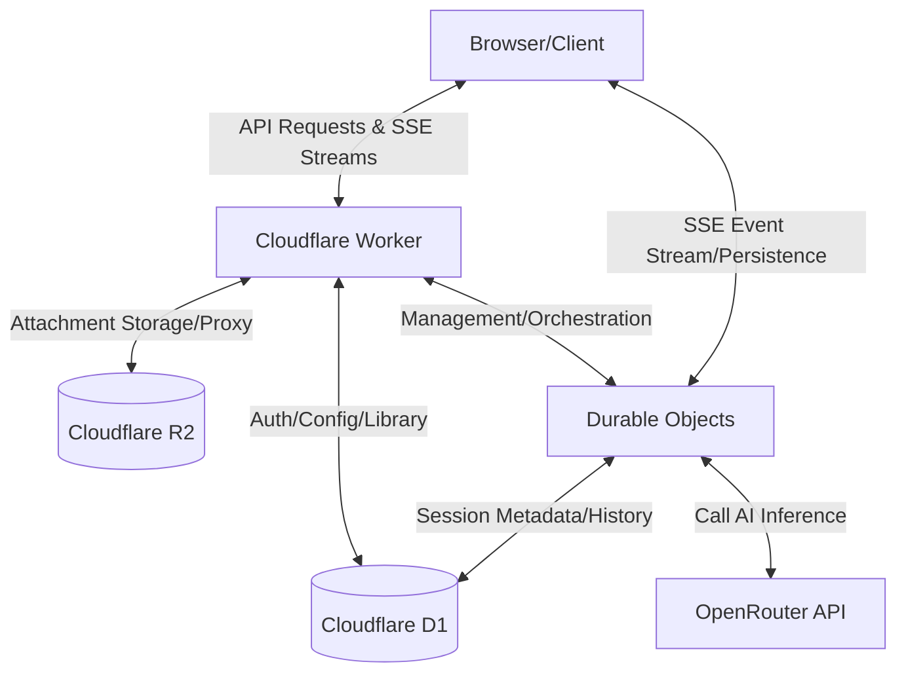

English | [简体中文](README-cn.md)

# Arona Chat


Arona Chat is a high-performance AI chat interface inspired by the _Blue Archive_ "Shittim Chest" UI. Built as a monorepo, it leverages the Cloudflare serverless ecosystem (Workers, D1, R2, Durable Objects) to deliver a cost-efficient, stateful chat experience.

---

## Architecture Overview

Arona Chat uses **Durable Objects** to decouple client connectivity from inference, ensuring resilient, asynchronous SSE orchestration.



## Screenshots


## Key Technical Highlights

- **Multi-Model Intelligence & Cost Analytics:** Seamlessly integrated with OpenRouter, featuring native, real-time token usage and USD cost tracking.
- **Stateful, Resilient SSE Orchestration:** Decoupled connectivity via Durable Objects ensures uninterrupted processing despite network drops and guarantees atomic persistence to D1.

## Features

- Chat sessions with route-based navigation
- Password and passkey authentication
- Workspaces, attachments, and library management
- Model selection and chat settings

## Prerequisites

Before running the project locally, ensure you have the following installed:

- **Node.js**: v20+ (LTS recommended)
- **Wrangler CLI**: `npm install -g wrangler`
- **Cloudflare Account**: For D1/R2/DO deployment

## Quick Start

1. **Install dependencies:**

   ```bash
   npm install
   ```

2. **Prepare backend variables:**

   ```bash
   cp backend/.dev.vars.example backend/.dev.vars
   # Edit backend/.dev.vars with your API keys and configuration
   ```

3. **Start development:**
   ```bash
   npm run dev
   ```

_See `package.json` for all available scripts._

---

## Repository Status

This is a **public mirror** of the Arona Chat project. Development occurs in a private upstream repository; this mirror is updated periodically with stable versions.

## Contributions

Issues are welcome for bug reports and feedback. Pull requests are not the primary workflow for this repository.

## Resource and Trademark Notice

See [docs/RESOURCE_COPYRIGHT.md](docs/RESOURCE_COPYRIGHT.md) for the _Blue Archive_ resource notice.

This repository is a fan-made project and is not affiliated with Blue Archive, NEXON, Nexon Games, or Yostar. "Blue Archive" and "Arona" are trademarks and/or copyrights of their respective owners.

## License

This repository is licensed under the **GNU Affero General Public License v3**. See [LICENSE](LICENSE).
