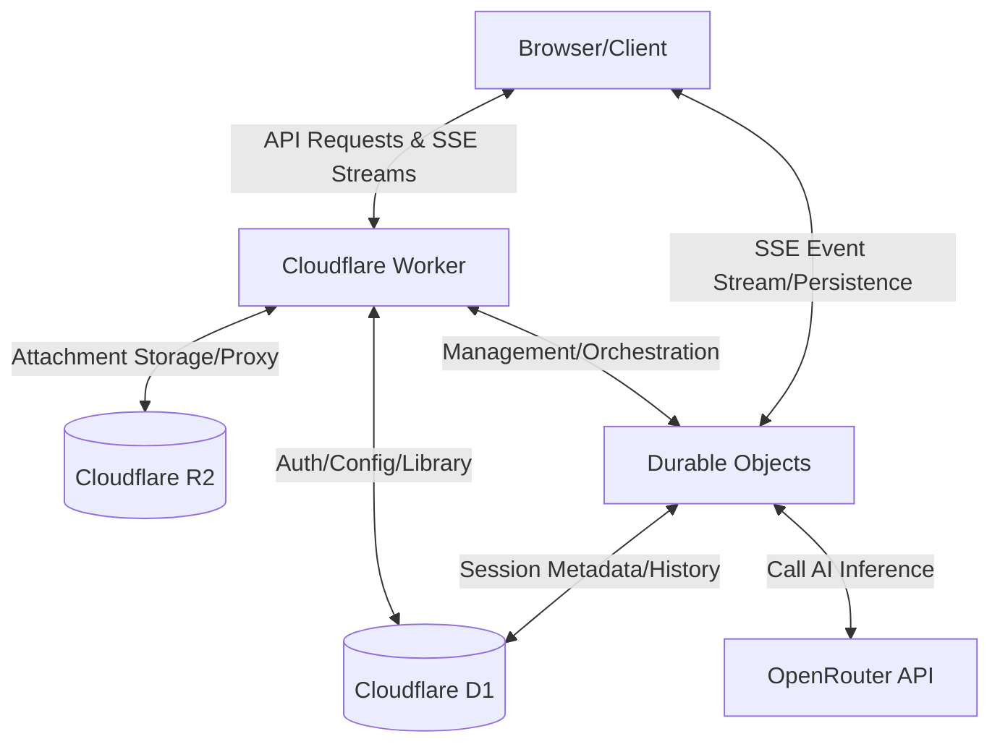
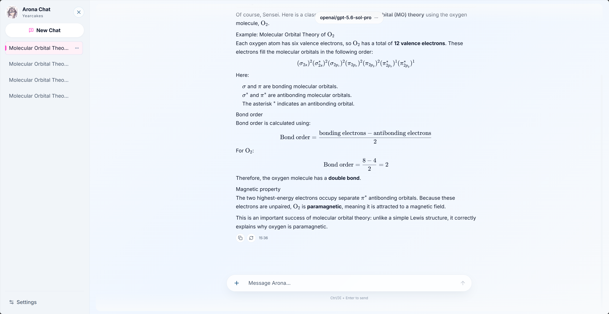
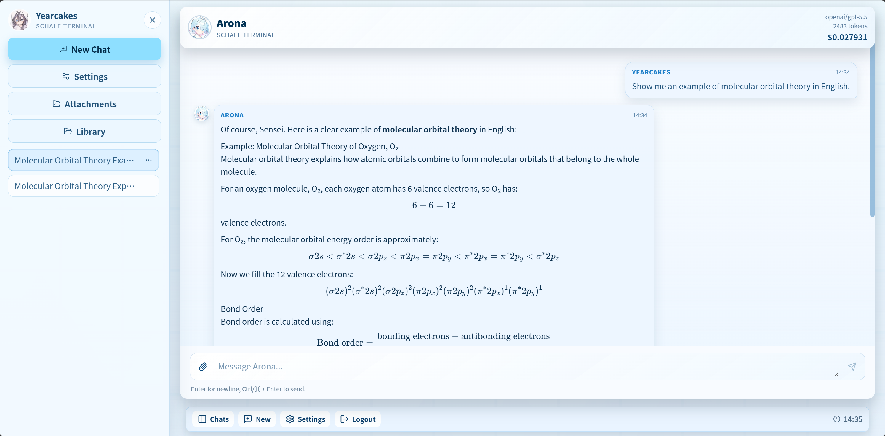

English | [简体中文](README-cn.md)

# 🌸 Arona Chat


[](https://arona-chat-open.pages.dev/login?password=preview&autologin=1)


AronaChat is a modern, high-performance AI chat application inspired by the Blue Archive “Shittim Chest” UI. It is built on a cloud-native serverless architecture, focusing on efficiency, scalability, and maintainability while keeping infrastructure complexity and operational costs low.

Unlike traditional applications that rely on manually managed servers, AronaChat leverages the Cloudflare serverless ecosystem, including Workers, D1, R2, and Durable Objects, to provide serverless compute, persistent data storage, object storage, and stateful services. This architecture enables a lightweight yet flexible platform that can efficiently handle AI-powered conversations.

Built as a monorepo, AronaChat integrates frontend, backend, and infrastructure components into a unified development workflow. The project is designed with production-oriented principles, including extensibility, reliability, and cost efficiency.

While currently serving personal use and demo testers, AronaChat’s architecture is designed to support future growth into a larger-scale production service with minimal architectural changes.

## 🧠 System Architecture


```mermaid
graph TD
    Client[Browser/Client] <-->|API Requests & SSE Streams| Worker[Cloudflare Worker]

    Worker <-->|Auth/Config/Library| D1[(Cloudflare D1)]
    Worker <-->|Attachment Storage/Proxy| R2[(Cloudflare R2)]
    Worker <-->|Management/Orchestration| DO[Durable Objects]

    DO <-->|SSE Event Stream/Persistence| Client
    DO <-->|Session Metadata/History| D1
    DO <-->|Call AI Inference| API[OpenRouter API]
```

## 🧠 Highlights

- 💰 **Real-time cost tracking** (tokens + USD usage)
- 🧠 **Multi-model orchestration** via OpenRouter
- 📡 **Stateful SSE streaming** with Durable Objects
- 🧷 **Resilient connection layer** (auto recovery on disconnect)

## 🖼️ Screenshots

> Arona Chat Interface | Ethereal Light Theme



> Arona Chat Interface | Blue Archive Theme



## 🚀 Quick Start

```bash
npm install
```

```bash
cp backend/.dev.vars.example backend/.dev.vars
```

```bash
npm run dev
```

## 🌟 Project Origin

This project was developed as part of HackClub Stardance.

View the original project page: [https://stardance.hackclub.com/projects/17862](https://stardance.hackclub.com/projects/17862)

## 📁 Repository Status

This is a **public mirror** of the Arona Chat project.
Development occurs in a private upstream repository; this mirror is updated periodically with stable versions.

## 🤝 Contributions

Issues are welcome for bug reports and feedback.

## License

Licensed under **GNU Affero General Public License v3**.
See [LICENSE](LICENSE).

## Resource Notice

See [docs/RESOURCE_COPYRIGHT.md](docs/RESOURCE_COPYRIGHT.md)

This is a fan-made project and is not affiliated with Blue Archive, NEXON, Nexon Games, or Yostar.
