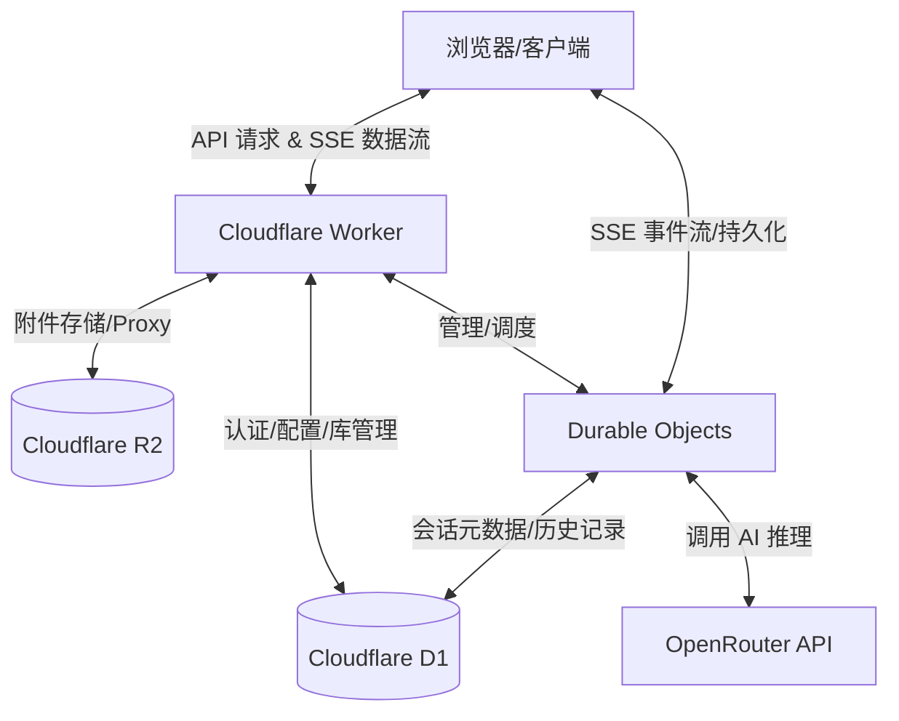

# 📌 Arona Chat 评估与演示指南

## 概述

Arona Chat 是一款基于 Cloudflare 生态系统（Workers, D1, R2, Durable Objects）构建的全栈 AI 聊天应用。

由于项目的运行依赖于 Cloudflare 和 OpenRouter 的付费基础设施资源（特别是 OpenRouter API 的调用成本），本项目**无法提供持续托管的公共在线演示服务**。

为了方便您评估系统的功能与架构，本指南通过功能模块拆解、可视化截图及架构解析，为您提供完整的项目概览。

---

## 📸 功能演示

以下展示了 Arona Chat 的核心交互界面与功能模块。

### 1. 聊天与会话管理

### 2. 成本追踪

### 3. 附件管理

---

## 🛠 如何深入评估本项目

即使没有在线 demo，您依然可以通过以下方式全面评估 Arona Chat：

### 方式一：本地部署评估（推荐）

这是体验系统完整功能的最佳方式：

1. 克隆本项目仓库。
2. 安装依赖：`npm install`。
3. 配置后端环境变量（参考 `backend/.dev.vars.example`）。
4. 运行开发环境：`npm run dev`。

### 方式二：代码级架构审查

您可以通过分析以下核心代码逻辑了解项目运作方式：

- **后端 API 与路由**: `backend/src/index.ts`
- **数据库交互层**: `backend/src/db/`
- **会话管理与 AI 推理**: `backend/src/ChatSessionDurableObject.ts`
- **前端状态管理**: `frontend/src/store/useStore.ts`

---

## 📊 架构解析

Arona Chat 的设计充分利用了 Serverless 生态，将复杂的 AI 推理状态卸载至 Durable Objects：

