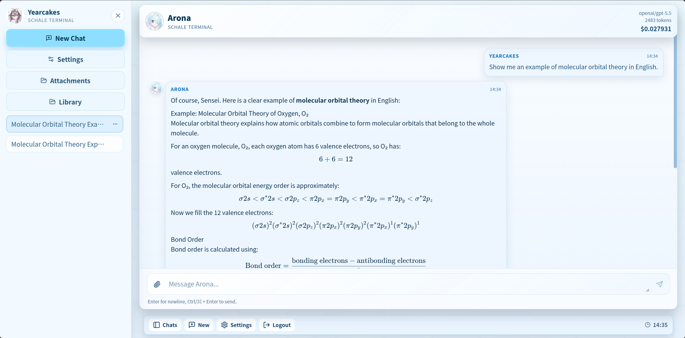
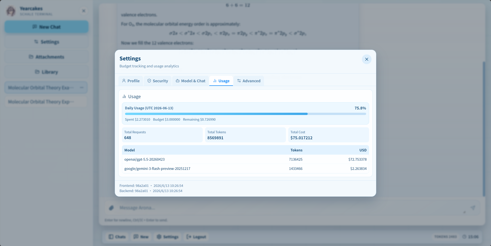
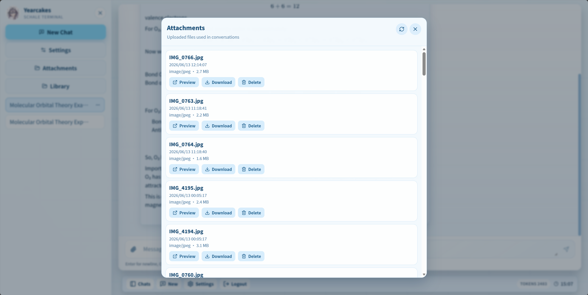
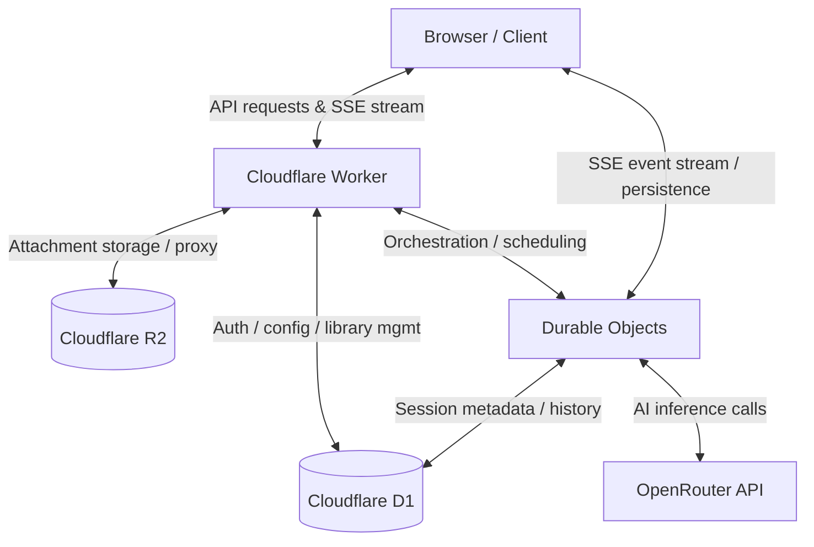

# 📌 Arona Chat Evaluation & Demo Guide

## Overview

Arona Chat is a full-stack AI chat application built on the Cloudflare ecosystem (Workers, D1, R2, and Durable Objects).

Due to its reliance on paid infrastructure services, particularly Cloudflare resources and OpenRouter API usage costs, a continuously hosted public demo is not provided.

Instead, this guide offers a complete overview of the system through feature breakdowns, visual screenshots, and architectural explanations to support full evaluation of the project.

---

## 📸 Feature Showcase

The following sections demonstrate the core user interface and functionality of Arona Chat.

### 1. Chat & Session Management



### 2. Cost Tracking



### 3. Attachment Management



---

## 🛠 How to Evaluate This Project

Even without a live demo, Arona Chat can be fully evaluated through the following methods:

### Option 1: Local Deployment (Recommended)

This is the best way to experience the full system functionality:

1. Clone the repository
2. Install dependencies:

   ```bash
   npm install
   ```

3. Configure backend environment variables (see `backend/.dev.vars.example`)
4. Start the development server:

   ```bash
   npm run dev
   ```

---

### Option 2: Code-Level Architecture Review

The system behavior can be understood by reviewing the following core modules:

- **Backend API & Routing**: `backend/src/index.ts`
- **Database Layer (D1 integration)**: `backend/src/db/`
- **Session Management & AI Orchestration**: `backend/src/ChatSessionDurableObject.ts`
- **Frontend State Management**: `frontend/src/store/useStore.ts`

---

## 📊 Architecture Overview

Arona Chat is designed as a serverless-first system, leveraging Cloudflare’s edge infrastructure to offload stateful AI session handling to Durable Objects.



---

## 📌 Notes

- This project prioritizes system architecture and performance stability over always-on public hosting.
- All core functionality is fully implemented and reproducible in a local environment.
- The system is designed with scalability in mind under serverless constraints.

---

## ✅ Summary

Even without a live demo, the project can be fully evaluated via:

- Local execution
- Code review
- UI screenshots
- Architectural analysis
