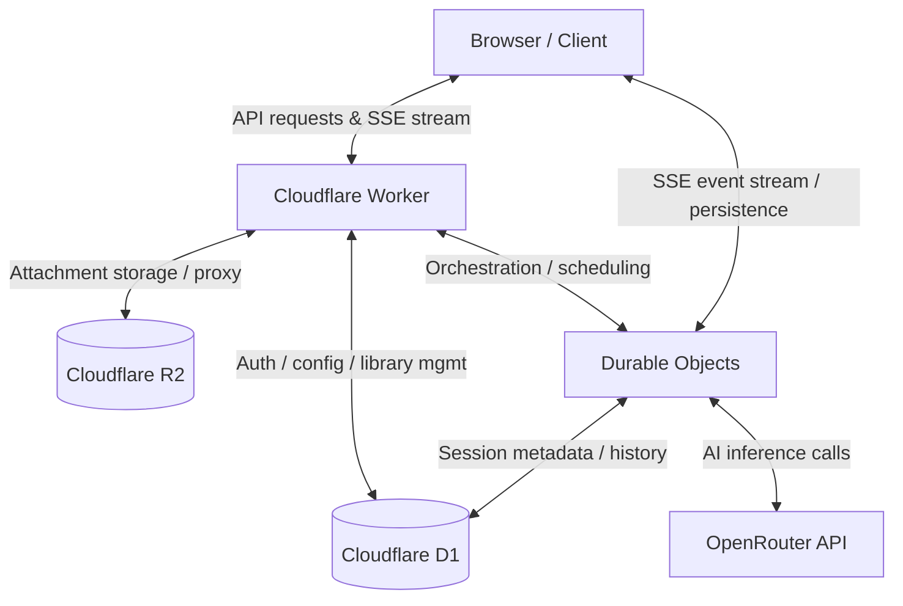

# 📌 Arona Chat Evaluation & Demo Guide

## 🌐 Public Preview

**Preview URL:** https://arona-chat-open.pages.dev/

**Password:** `preview`

To make evaluation easier for reviewers, a public preview deployment is available.

The preview deployment preserves the authentication flow and overall user experience while disabling AI inference to avoid ongoing infrastructure and API costs.

Available functionality includes:

- Authentication flow
- Chat interface
- Session management
- Workspace navigation
- Attachment management
- Cost tracking interface
- General application workflow

The following functionality is intentionally disabled:

- AI inference requests
- OpenRouter API integration
- Production model execution

---

## Overview

Arona Chat is a full-stack AI chat application built on the Cloudflare ecosystem (Workers, D1, R2, and Durable Objects).

A public preview deployment is available to make evaluation easier for reviewers. To keep infrastructure and AI inference costs manageable, the public deployment runs in **Preview Mode**, where AI inference is disabled.

This guide provides a complete overview of the system through feature breakdowns, visual screenshots, and architectural explanations.

---

## 📸 Feature Showcase

The following sections demonstrate the core user interface and functionality of Arona Chat.

### 1. Chat & Session Management


### 2. Cost Tracking


### 3. Attachment Management


---

## 🛠 How to Evaluate This Project

Arona Chat can be evaluated through the following methods:

### Option 1: Public Preview (Recommended)

Explore the deployed preview to experience the application's interface, navigation, and workflow.

### Option 2: Local Deployment

This is the best way to experience the full system functionality, including AI inference:

1. Clone the repository
2. Install dependencies:

   ```bash
   npm install
   ```

3. Configure backend environment variables (see `backend/.dev.vars.example`)
4. Start the development server:

   ```bash
   npm run dev
   ```

---

### Option 3: Code-Level Architecture Review

The system behavior can be understood by reviewing the following core modules:

- **Backend API & Routing**: `backend/src/index.ts`
- **Database Layer (D1 integration)**: `backend/src/db/`
- **Session Management & AI Orchestration**: `backend/src/ChatSessionDurableObject.ts`
- **Frontend State Management**: `frontend/src/store/useStore.ts`

---

## 📊 Architecture Overview

Arona Chat is designed as a serverless-first system, leveraging Cloudflare’s edge infrastructure to offload stateful AI session handling to Durable Objects.



---

## 📌 Notes

- The public deployment runs in Preview Mode and is intended for evaluation purposes.
- AI inference is disabled in the public preview to avoid ongoing API costs.
- The complete implementation is available in the repository and can be reproduced locally.
- All core architecture, caching, session management, and backend logic are included in the source code.
- The system is designed with scalability, performance, and cost efficiency in mind under serverless constraints.